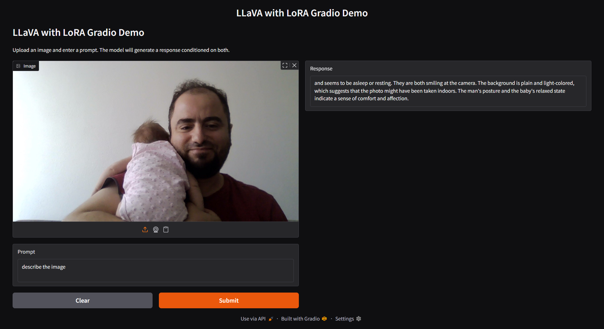

# Installation

To set up the environment for this project, use the provided requirements files and pip. This ensures all dependencies (including those for training, evaluation, and Gradio demos) are installed with compatible versions.

1. **Clone the repository**
   ```bash
   git clone <your-repo-url>
   cd LLaVA
   ```

2. **Install core dependencies**
   ```bash
   pip install -r requirements/train.txt
   pip install -r requirements/eval.txt
   ```
   (You may also use a virtual environment or conda environment if desired.)

3. **(Optional) Install additional system packages**
   Some scripts (e.g., AMBER evaluation) require `spacy` models and `nltk` data:
   ```bash
   python -m spacy download en_core_web_lg
   python -c "import nltk; nltk.download('wordnet')"
   ```

4. **(Optional) For Gradio UI**
   If you want to use the Gradio web demos, ensure you have the correct version of Gradio:
   ```bash
   pip install gradio==4.16.0 gradio_client==0.8.1
   ```

5. **(Optional) For quantization and vLLM**
   If you plan to use quantization or vLLM, install any additional dependencies as needed (see script headers or comments).

# Approach

## Understanding the task

The task is to align a vision language model ([[LLaVA-1.6 7B VLM]]) based on feedback of a multi-modal language model (as seen in[[ RLAIF-V]]), with a designated novel loss function ([[ORPO]]). 

Based on the fact that the RLAIF-V has been proposed as the aligning method, we assume that the objective of the aligment is going to be to increase the trustworthiness of the model. In other words, mitigating the hallucinations.

The RLAIF-V method depends on AI feedback. This necessitates an additional LLM to generate tokens on the fly, which makes the alignment process resource heavy. This is where the ORPO comes in. ORPO (Monolithic Preference Optimization without Reference Model) does not necessitate an additional model. This reduces the memory requirements for the alignment process significantly.
## Understanding the data

### What is RLAIF?

### Some data Samples

## Setting up a Baseline

Now, how do I quantify the success of my task? In their blog post, Gallouedec et al. mention

> As mentioned above, the [openbmb/RLAIF-V-Dataset](https://huggingface.co/datasets/openbmb/RLAIF-V-Dataset) is designed to reduce hallucinations. But has the fine-tuning actually reduced hallucinations? To find out, we can use the [AMBER benchmark](https://arxiv.org/abs/2311.07397), a dataset specifically created to evaluate hallucinations in VLMs.

this means I can start my project with benchmarking [[LLaVA-1.6 7B VLM]] on [[AMBER benchmark]]. This will involve in generating inferences for questions in AMBER benchmark using LLaVA and measuring their hallucination level. 

Below are the scores results of off-the-shelf [[LLaVA-1.6 7B VLM]] on [[AMBER benchmark]]. We restrict our test on generative task for the sake of simplicity and time.   
### Generative Task Performance:
- CHAIR: 8.6 (lower is better - measures hallucination)
- Cover: 50.0% (measures coverage of objects)
- Hal: 33.3% (measures hallucination rate)
- Cog: 2.8 (cognitive alignment score)

The LLaVA-1.6 7B results are comparable to the results provided in the original AMBER paper.


The results above will serve as a reference in terms of how much we have been able to increase the trustworthiness of the model. 

## Qualitative Comparison: Before and After Alignment

Below are side-by-side comparisons of model outputs on selected AMBER benchmark images, before and after ORPO-based alignment. These examples illustrate the qualitative improvements in hallucination reduction and cognitive alignment.

| Before Alignment (Original LLaVA) | After Alignment (LLaVA + ORPO LoRA) |
|:---------------------------------:|:-----------------------------------:|
|  |  |
|  |  |

The left column shows the model's output before alignment, while the right column shows the output after applying the ORPO-aligned LoRA. Notice the reduction in hallucinated content and the improved relevance of the responses after alignment.

### Example: Man with Baby
- **Before:**
  > and seems to be asleep or resting. They are both smiling at the camera. The background is plain and light-colored, which suggests that the photo might have been taken indoors. The man's posture and the baby's relaxed state indicate a sense of comfort and affection. *(babies face is actually not visible - hallucination)*
- **After:**
  > camera with a smile on his face, creating a warm and affectionate scene. The child is dressed in a pink outfit, adding a touch of color to the image. The overall athmosphere suggests a close and loving relationship between the man and the child.

### Example: Crowd at Monument
- **Before:**
  > is geometric, with a grid-like pattern that indicates a planned, organized layout. In the background, there are buildings and a body of water, which could be a river or a lake. The setting is outdoors and the weather appears to be sunny, making it a pleasant day for outdoor activities. The numbers on the image likely correspond to the different sections of the area, possibly for identification or inventory purposes.
- **After:**
  > for the attendees. In the background, there is a beautiful view of the Washington Monument, which adds a sense of grandeur to the scene.
  >
  > The crowd is dispersed throughout the field, with some people standing closer to the tents, while others are further away. The gathering appears to be a large outdoor event, possibly a picnic or a celebration, as the people are enjoying their time together in the open space. 
  >
  > The presence of the Washington Monument and the crowd's size suggest that this event might be taking place in a city, with the monument serving as a notable landmark. Overall, the image captures a lively and vibrant atmosphere, highlighting the beauty of a sunny day in an open space with a stunning backdrop.

These qualitative results show that after alignment, the model's descriptions became more cognitively sound and detailed. Hallucinations (such as describing a baby's face that is not visible) are reduced, and the model provides richer, more contextually appropriate details (such as referencing the Washington Monument and describing the atmosphere of the event). The after-alignment outputs demonstrate a better understanding of the scene and avoid making unsupported claims.

These findings are consistent with the quantitative improvements observed in the AMBER benchmark, where the model showed lower hallucination rates and better cognitive alignment scores after ORPO-based alignment. The qualitative and quantitative results together confirm that the alignment process not only reduces hallucinations but also enhances the overall quality and trustworthiness of the model's outputs.

## Training LLaVA on RLAIF-V with ORPO

Now, I have trained a LoRA of the LLaVA model with ORPO on RLAIF-V. My next step is to measure the performance of LLaVA LoRA on AMBER. 
### Generative Task Performance:
- CHAIR: 10.2 (worse)
- Cover: 43.6% (worse)
- Hal: 31.1% (better)
- Cog: 2.6 (better)

We have improved the model on two metrics : Hal and Cog. Now we have better cognitive alignment and lower hallucination while also worse coverage of objects. 

## Hosting LLaVA with RLAIF-V LoRA on Gradio

To make the aligned LLaVA model accessible and easy to test, I implemented Gradio-based hosting scripts for both the standard and quantized models. The Gradio interface allows users to upload an image and enter a prompt, and then receive a response from the model that is conditioned on both the image and the text.

- **llava_gradio_lora_host.py**: This script loads the LLaVA model, optionally merges a LoRA adapter, and exposes a simple Gradio web UI. The user can interactively test the model's multi-modal capabilities. The script handles all the necessary input preparation, including image processing and prompt formatting, and ensures that the LoRA weights are properly merged for inference.

- **llava_gradio_lora_host_quantized.py**: This script is similar in spirit, but is designed to work with a quantized model using vLLM. It loads the quantized model, sets up the vLLM backend, and exposes the same Gradio interface. This allows for efficient inference with reduced memory requirements, making it possible to serve the model on more modest hardware.

Both scripts provide a user-friendly way to evaluate the model's performance after alignment and quantization, and were essential for rapid iteration and demonstration.

## Quantization with VLLM

To further reduce the memory and compute requirements for serving the aligned LLaVA model, I implemented quantization using the vLLM and llmcompressor toolkits.

- **llava_quantize_vllm.py**: This script loads the base LLaVA model, merges the LoRA adapter, and then applies FP8 dynamic quantization to all linear layers except the output head. The quantized model is then saved for later use. This process enables much more efficient inference, especially when combined with the vLLM runtime, and is crucial for deploying large vision-language models in resource-constrained environments.

The quantized model can be loaded and served using the Gradio script described above, providing a seamless workflow from training to efficient deployment.

## AMBER Benchmarking and Evaluation

- **llava_amber_validation_benchmark_with_lora.py**: This script automates the process of running the AMBER benchmark on the LLaVA model (with or without LoRA). It loads the model, processes the AMBER queries and images, generates responses, and then runs the official AMBER evaluation script to compute all relevant metrics. This was critical for objectively measuring the impact of ORPO-based alignment and for comparing different model variants.

## ORPO Training Implementation

- **llava_orpo_training.py**: This script implements full-scale ORPO training for LLaVA v1.6 7B on the RLAIF-V dataset. It is carefully designed to avoid expanding the tokenizer vocabulary (a common source of errors when working with LoRA and vision tokens), and supports all necessary configuration for production-scale runs. The script leverages the TRL library's ORPOTrainer and integrates with Weights & Biases for experiment tracking.

## Summary of Scripts and Workflow

- **llava_amber_validation_benchmark_with_lora.py**: Benchmarking and evaluation on AMBER
- **llava_orpo_training.py**: ORPO training for LLaVA with LoRA
- **llava_gradio_lora_host.py**: Gradio UI for standard (FP16/BF16) LLaVA+LoRA
- **llava_quantize_vllm.py**: Quantization of LLaVA+LoRA for vLLM
- **llava_gradio_lora_host_quantized.py**: Gradio UI for quantized LLaVA+LoRA (vLLM backend)

## Script Usage Guide

Below is a brief explanation of how to use each script, including their main arguments and typical usage scenarios:

### llava_amber_validation_benchmark_with_lora.py
- **Purpose:** Run the AMBER benchmark on a LLaVA model (optionally with a LoRA adapter) and evaluate the results.
- **Usage Example:**
  ```bash
  python llava_amber_validation_benchmark_with_lora.py \
    --model_path liuhaotian/llava-v1.6-mistral-7b \
    --lora_path /path/to/lora/checkpoint \
    --query_file /workspace/AMBER/data/query/query_all.json \
    --image_dir /workspace/AMBER/image \
    --output_file results.json
  ```
- **Key Arguments:**
  - `--model_path`: Path or HuggingFace repo for the base LLaVA model
  - `--lora_path`: Path to the LoRA adapter (optional)
  - `--query_file`: Path to AMBER queries
  - `--image_dir`: Directory with AMBER images
  - `--output_file`: Where to save responses
  - `--skip_inference`, `--skip_evaluation`: Control which stages to run

### llava_orpo_training.py
- **Purpose:** Train a LLaVA model with ORPO on the RLAIF-V dataset, producing a LoRA adapter.
- **Usage Example:**
  ```bash
  python llava_orpo_training.py --output_dir ./checkpoints/llava-orpo-prod --epochs 3 --batch_size 4
  ```
- **Key Arguments:**
  - `--output_dir`: Where to save checkpoints
  - `--epochs`: Number of training epochs
  - `--batch_size`: Per-device batch size
  - `--lora_rank`: LoRA rank (optional)
  - `--gradient_accumulation_steps`: For large batch sizes
  - `--wandb_project`, `--wandb_entity`: For experiment tracking
  - `--test_mode`: Run a quick test with a small dataset

### llava_gradio_lora_host.py
- **Purpose:** Launch a Gradio web UI for interactive inference with LLaVA+LoRA.
- **Usage Example:**
  ```bash
  python llava_gradio_lora_host.py --model_path liuhaotian/llava-v1.6-mistral-7b --lora_path /path/to/lora/checkpoint
  ```
- **Key Arguments:**
  - `--model_path`: Path or repo for the base model
  - `--lora_path`: Path to LoRA adapter (optional)
  - `--device`: Device to run on (e.g., cuda, cpu)
  - `--load_8bit`, `--load_4bit`: Load model in 8-bit or 4-bit mode (optional)

### llava_quantize_vllm.py
- **Purpose:** Quantize a LLaVA+LoRA model using FP8 dynamic quantization for efficient vLLM inference.
- **Usage Example:**
  ```bash
  python llava_quantize_vllm.py
  ```
- **Key Arguments:**
  - Edit the script to set `MODEL_ID` and `LORA_PATH` as needed
  - The script saves the quantized model in the `quantized_models/` directory

### llava_gradio_lora_host_quantized.py
- **Purpose:** Launch a Gradio UI for a quantized LLaVA+LoRA model using the vLLM backend.
- **Usage Example:**
  ```bash
  python llava_gradio_lora_host_quantized.py --model_path /workspace/LLaVA/quantized_models/llava-v1.6-mistral-7b-FP8-Dynamic
  ```
- **Key Arguments:**
  - `--model_path`: Path to the quantized model directory
  - `--tensor_parallel_size`: For multi-GPU inference (optional)
  - `--max_num_seqs`: Max number of sequences (optional)
  - `--temperature`, `--max_tokens`: Sampling parameters

## Conclusion

Through a series of targeted modifications and new scripts, I was able to:
- Align LLaVA-1.6 7B with RLAIF-V using ORPO, while avoiding common pitfalls such as vocabulary expansion and library version mismatches
- Quantitatively benchmark the improvements using the AMBER benchmark
- Provide user-friendly Gradio interfaces for both standard and quantized models
- Enable efficient deployment via quantization and vLLM

These efforts resulted in a robust, reproducible workflow for aligning, evaluating, and serving vision-language models with minimal hallucination and strong cognitive alignment.

# Challenges
I encountered two hurdles while I was trying to do inference with LoRA:
## 1- Orpo - LLaVA transformer library version mismatch
we can fix this by using different transformers libraries during training and evaluation
	LLaVA needs transformers=4.37.2
	pretty much the best option since we wont need the orpo after we trained the model good enough
		here is a problem with that: it is not exactly very easy to load a LoRA without the libraries from the LoRA Trainer. And some of those libraries need the 4.37.2-incompatible LLaVA loader I guess.
	OR
we need to fix the orpo training and use the old transformers library during training.
	not possible, trl uses transformers>=4.50.0
better put:
	there is a library version mismatch between the LLaVA repository and trl, which has the orpo, which is needed for training. long story short training and evaluation has transformer library version mismatch.  
	LLaVA needs transformers=4.37.2  
	trl uses transformers>=4.50.0  
	The good news is that LoRA adapters are fundamentally just weight matrices that can be converted between different frameworks.
	But what is the problem with using transformers > 4.50 ? ---> it causes the model not to load, because of  [TypeError: LlavaLlamaForCausalLM.forward() got an unexpected keyword argument 'cache_position'](https://github.com/huggingface/transformers/issues/29426#top)
SOLVED: Fixed this with a workaround, just added the dummy parameter cache_position to the function to avoid this trivial syntactic error
	
## 2- Vocabulary size mismatch

During ORPO training, the <image> token was added to the tokenizer, expanding the vocabulary from 32,000 to 32,001 tokens. But when we load the base model fresh, this token isn't added, causing the size mismatch.
	one way to fix it is to extend the attention map with a zero, where the token <image> resides
		OR
	we need to fix orpo training.
SOLVED: Solved this by fixing the orpo training. I have made sure that it does not expand the vocabulary.
